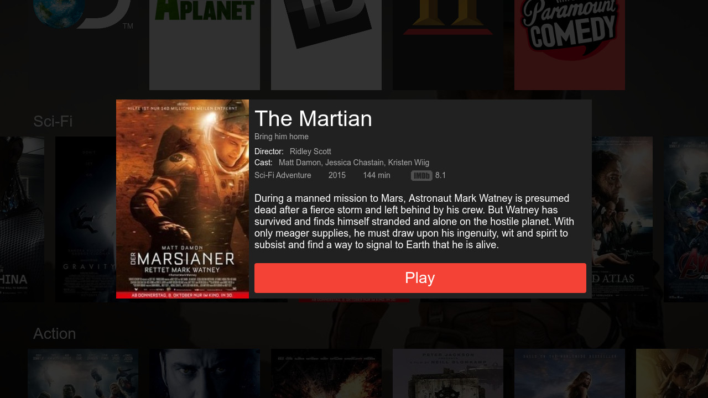

# PureOSD
PureQML app example for web browser and Smart TV



# Build & Install
Clone:
```
git clone https://github.com/pureqml/pureosd.git
git submodule init
git submodule update
```

### Web browser
```
./qmlcore/build
```
Then open `build.web/index.html` in your browser

### LG Smart TV
```
./smart-tv-deployer/build.py -p webos|tizen|orsay|netcast
```
For Tizen platform you should build 1080p OSD you can set `resolutionWidth: 1920, resolutionHeight: 1080` properties in manifest or you can build tizen platform build with `-s resolutionWidth 1920 -s resolutionHeight 1080` flags.
